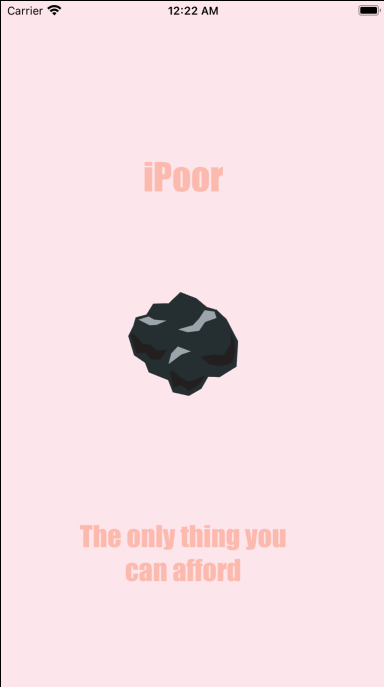
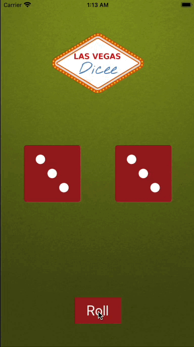

# iOSAppDevelopmentMarathon
Based on course iOS &amp; Swift - The Complete iOS App Development Bootcamp by Angela Yu.

https://www.udemy.com/course/ios-13-app-development-bootcamp/

Projects                                                                                                                                                                     | Screenshots
---                                                                                                                                                                          |---
[Project 1](P01-IAmPoor) - *I am Poor*     Displays only one screen with imageView, without any constraints yet                                               |  |
[Project 2](P02-Dicee) - *Dicee*     Get a random dices by tap the button roll.   UI is anchored via constraints                                                                                |  |
